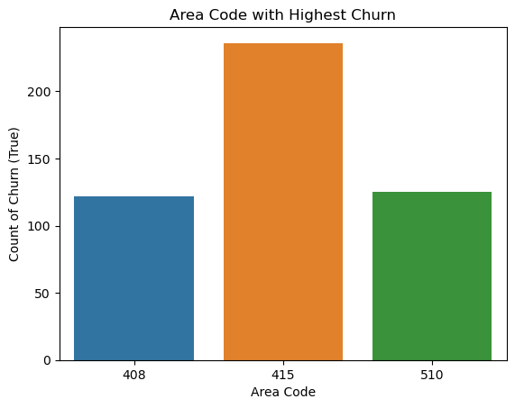
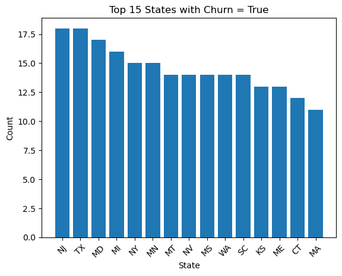
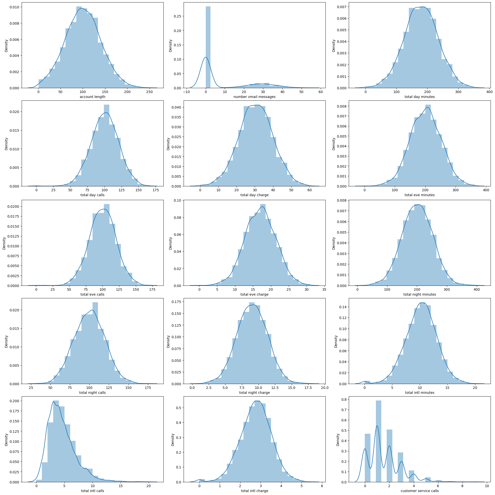
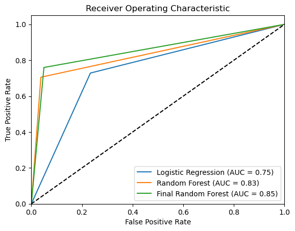

# SyriaTel Customer Churn

## Business Overview

SyriaTel is a leading provider of telecommunications services in the United States. It offers a wide range of services, including wireless, wireline, and internet services. The company has been in business for over 50 years and has a strong customer base.

## Problem Statement

In recent years, the company has been facing an issue with customer churn. Churn is the rate at which customers cancel their service with a company. The company's churn rate has been increasing over the past few years. This is a major concern for the company because it is losing revenue and customers.

## Objectives

The goal of this project is to:-

- Predict customers who are likely to churn. This will help the company to identify customers who are at risk of leaving and take steps to prevent them from leaving.
- Check for relationship between various variables and churn.
- Find out the features that most predict customer churn.

## Data Understanding and Analysis

### Source of Data

- The data used can be found [here](https://www.kaggle.com/datasets/becksddf/churn-in-telecoms-dataset)
- The features of the dataset are explained [here](Data.md)

### Exploratory Data Analysis

- Our data had 21 features that we worked with to come up with the best predictive model.
- We started by analyzing each of the features individually by looking at their characteristics and distribution.
- As part of preparing our data for analysis and modeling, we cleaned it as outlined stepwise in the notebook.
- Next, we looked at the relationship amongst the individual variables with churn.
- Checked for outliers and multicollinearity

### Data Visualization

#### Area code with the highest churn

#### States with the highest churn

#### Distribution of numeric variables

## Modelling

- Before modelling our data that had categorical variables, we one hot encoded them and also scaled the data
- The data was modelled against three models namely, a logistic regression model (baseline model), a random forest model and hyperparameter tuned random forest model.

- Here is the ROC curves of the three models

## Challenges

- Due to the presence of high multicollinearity among several predictor variables, we had to remove some of those columns from our analysis.

## Conclusion

- The variables that most predict customer churn include; total day minutes, customer service calls, international plan, total international calls and total evening minutes.

## Recommendations

- Offer customers a discount on their monthly bill if they use less minutes during peak hours. This could help to reduce the number of total day minutes that customers use, which could in turn reduce the number of customers who churn.
- Create a customer service portal where customers can easily find answers to their questions. This could help to reduce the number of customer service calls that customers make, which could in turn reduce the number of customers who churn.
- Offer customers an international plan that is more affordable. This could help to reduce the number of total international calls that customers make, which could in turn reduce the number of customers who churn.
- Send customers a text message or email reminder when they are nearing their monthly plan limits. This could help customers to be more mindful of their data usage, which could in turn reduce the number of customers who churn.
- Offer customers a loyalty program that rewards them for staying with the company. This could help to create a sense of loyalty and make customers less likely to churn.

## Future work

- Using more advanced machine learning algorithms to see if one predict customer churn better.
- Using more data: The more data that is used to train the model, the more accurate the predictions will be. 
- 
